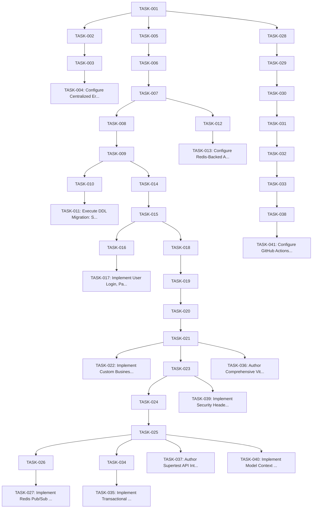

# Task Execution Dependency Graph (DAG): Ekklesia

```mermaid
flowchart TD
    TASK001["TASK-001"] --> TASK002["TASK-002: Setup Core Environment C..."]
    TASK002["TASK-002"] --> TASK003["TASK-003: Implement Structured Log..."]
    TASK003["TASK-003"] --> TASK004["TASK-004: Configure Centralized Er..."]
    TASK001["TASK-001"] --> TASK005["TASK-005: Author Multi-Stage Produ..."]
    TASK005["TASK-005"] --> TASK006["TASK-006: Orchestrate Local Develo..."]
    TASK006["TASK-006"] --> TASK007["TASK-007: Initialize Database Conn..."]
    TASK007["TASK-007"] --> TASK008["TASK-008: Execute DDL Migration: C..."]
    TASK008["TASK-008"] --> TASK009["TASK-009: Execute DDL Migration: U..."]
    TASK009["TASK-009"] --> TASK010["TASK-010: Execute DDL Migration: C..."]
    TASK010["TASK-010"] --> TASK011["TASK-011: Execute DDL Migration: S..."]
    TASK007["TASK-007"] --> TASK012["TASK-012: Configure Redis Client P..."]
    TASK012["TASK-012"] --> TASK013["TASK-013: Configure Redis-Backed A..."]
    TASK009["TASK-009"] --> TASK014["TASK-014: Implement Cryptographic ..."]
    TASK014["TASK-014"] --> TASK015["TASK-015: Implement JWT Token Mana..."]
    TASK015["TASK-015"] --> TASK016["TASK-016: Implement User Registrat..."]
    TASK016["TASK-016"] --> TASK017["TASK-017: Implement User Login, Pa..."]
    TASK015["TASK-015"] --> TASK018["TASK-018: Construct Role-Based Acc..."]
    TASK018["TASK-018"] --> TASK019["TASK-019: Implement Multi-Tenant R..."]
    TASK019["TASK-019"] --> TASK020["TASK-020: Implement Core Domain En..."]
    TASK020["TASK-020"] --> TASK021["TASK-021: Implement Domain Busines..."]
    TASK021["TASK-021"] --> TASK022["TASK-022: Implement Custom Busines..."]
    TASK021["TASK-021"] --> TASK023["TASK-023: Build API Gateway Router..."]
    TASK023["TASK-023"] --> TASK024["TASK-024: Implement REST Endpoints..."]
    TASK024["TASK-024"] --> TASK025["TASK-025: Implement REST Endpoints..."]
    TASK025["TASK-025"] --> TASK026["TASK-026: Implement WebSocket Gate..."]
    TASK026["TASK-026"] --> TASK027["TASK-027: Implement Redis Pub/Sub ..."]
    TASK001["TASK-001"] --> TASK028["TASK-028: Build Frontend Applicati..."]
    TASK028["TASK-028"] --> TASK029["TASK-029: Implement Reactive Globa..."]
    TASK029["TASK-029"] --> TASK030["TASK-030: Build Authentication Vie..."]
    TASK030["TASK-030"] --> TASK031["TASK-031: Build Executive Operatio..."]
    TASK031["TASK-031"] --> TASK032["TASK-032: Build Paginated Data Tab..."]
    TASK032["TASK-032"] --> TASK033["TASK-033: Build Interactive Map Vi..."]
    TASK025["TASK-025"] --> TASK034["TASK-034: Implement Payment Gatewa..."]
    TASK034["TASK-034"] --> TASK035["TASK-035: Implement Transactional ..."]
    TASK021["TASK-021"] --> TASK036["TASK-036: Author Comprehensive Vit..."]
    TASK025["TASK-025"] --> TASK037["TASK-037: Author Supertest API Int..."]
    TASK033["TASK-033"] --> TASK038["TASK-038: Author Playwright End-to..."]
    TASK023["TASK-023"] --> TASK039["TASK-039: Implement Security Heade..."]
    TASK025["TASK-025"] --> TASK040["TASK-040: Implement Model Context ..."]
    TASK038["TASK-038"] --> TASK041["TASK-041: Configure GitHub Actions..."]
```
